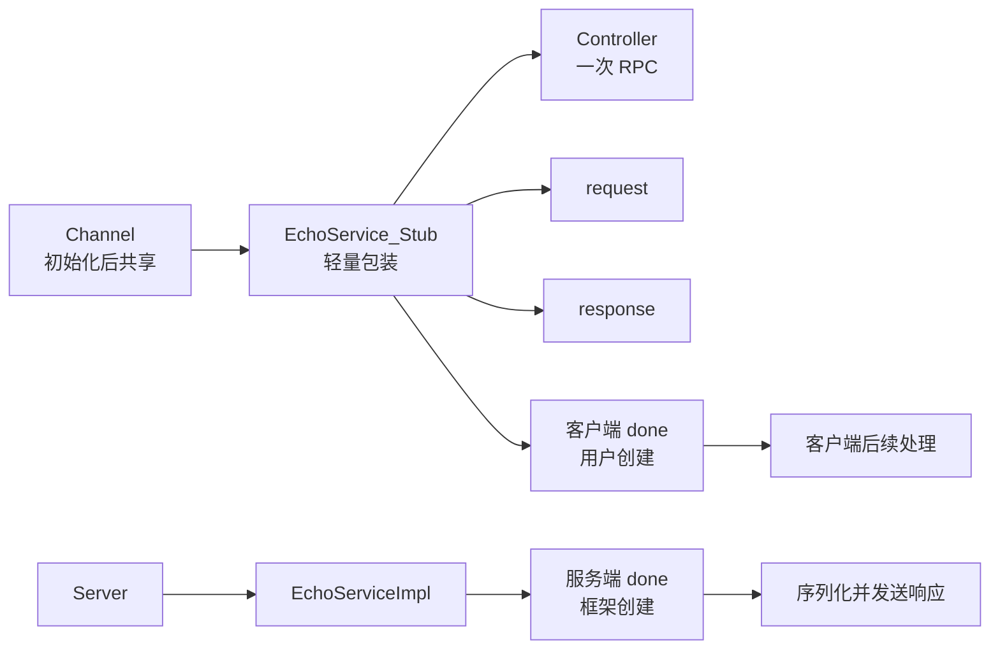

# 第 2 周：API 契约与对象生命周期

> 导航：[八周总计划](learning-plan.md) · [上一周：环境与 Echo](01-environment-and-echo.md) · [下一周：RPC 生命周期](03-rpc-lifecycle.md)
>
> 建议投入：6–8 小时，分 5 次完成。本页是学习任务，不是执行记录；实际命令、输出和结论写入 `notes/records/week-02.md`，原始日志放入 `build/learning-records/week-02/`。

## 本周完成标准

本周不追求读完所有客户端和服务端实现，而是建立一套不会因同步/异步切换而失效的对象模型。完成后应能根据接口契约判断各对象生命周期，将同步 Echo 改成可等待、可退出的异步调用，并用 `Controller::SetFailed` 区分 RPC 失败与正常响应。

还应能解释 `ClosureGuard`、`release()`、两种 Service ownership，并用指定单测核对服务启动、请求处理、停止和等待完成的契约。

## 前置条件与目录约定

- 已完成第 1 周：`build/learning/output/lib/libbrpc.a` 和 `build/learning/output/include` 可用，原始 Echo 可启动。
- 保留 `example/echo_c++` 作为未修改基线；从本周起，所有示例修改只发生在 `example/learning_echo_c++`。
- 命令均在仓库根目录执行；主库构建目录为 `build/learning`，学习副本构建目录为 `build/learning-lab`。
- 本周若构建或实验受阻，记录首个实质错误、环境和已尝试动作，不把“未运行”写成“验证通过”。

先准备记录目录；每个需要用 `tee` 保存证据的 zsh 终端都先启用 `pipefail`，否则管道前段失败可能被 `tee` 的成功退出掩盖：

```bash
mkdir -p build/learning-records/week-02 notes/records
set -o pipefail
```

首次建立学习副本：

```bash
mkdir -p example/learning_echo_c++
cp example/echo_c++/{client.cpp,server.cpp,echo.proto,CMakeLists.txt} \
  example/learning_echo_c++/
```

只复制这四个文件，使副本仍与 `example/cmake/BrpcExample.cmake` 保持相邻目录关系。配置副本：

```bash
cmake -S example/learning_echo_c++ -B build/learning-lab \
  -DCMAKE_BUILD_TYPE=Debug \
  -DBRPC_INCLUDE_PATH="$PWD/build/learning/output/include" \
  -DBRPC_LIB="$PWD/build/learning/output/lib/libbrpc.a"
cmake --build build/learning-lab --parallel 4
```

macOS + Homebrew 将配置命令写成完整命令（以下可直接执行）：

```bash
cmake -S example/learning_echo_c++ -B build/learning-lab \
  -DCMAKE_BUILD_TYPE=Debug \
  -DBRPC_INCLUDE_PATH="$PWD/build/learning/output/include" \
  -DBRPC_LIB="$PWD/build/learning/output/lib/libbrpc.a" \
  -DCMAKE_PREFIX_PATH="$(brew --prefix)" \
  -DOPENSSL_ROOT_DIR="$(brew --prefix openssl@3)"
```

## 先建立对象关系图



先在记录中填表，实验后修正。不要从“一次运行没崩”推导线程安全或生命周期安全。

| 对象 | 创建者/持有者 | 并发共享 | 最早释放时机 | 本周重点契约 |
| --- | --- | --- | --- | --- |
| `Channel` | 用户 | `CallMethod` 可共享 | 不再发起调用时；异步发出后可析构 | `Init` 本身非线程安全且成功后不可再次初始化 |
| `EchoService_Stub` | 用户，内部指向 Channel | 可共享 | 不再发起调用时 | 轻量包装，不拥有本次调用状态 |
| `Controller` | 用户或每次调用状态 | 不可被并发 RPC 共用 | 同步返回后；异步完成及回调结束后 | 一个 Controller 对应一次进行中的 RPC，复用前 `Reset()` |
| request | 用户 | 取决于用户同步方式 | 普通 Channel 异步发出后可释放 | `SelectiveChannel` 是例外，本周不推广该结论 |
| response | 用户 | 不应跨未同步调用共享 | RPC 完成且回调不再访问后 | 异步期间仍由框架写入 |
| 客户端 `done` | 用户 | 不作为共享状态 | `Run()` 完成后，依具体 Closure 管理 | RPC 结束后由框架调用；`NewCallback` 可自删除 |
| Service | 用户或 Server | Server 内并发调用 | Server `Join()` 后，并遵守 ownership | ownership 参数决定析构责任 |
| 服务端 `done` | 框架 | 每请求独立 | 用户恰好调用一次 `Run()` 后 | `Run()` 触发响应后续处理；漏调会挂住请求 |

## 学习单元 1（70–85 分钟）：客户端接口契约

### 阅读定位

1. [客户端文档](../docs/cn/client.md)：先读“事实速查”和“异步访问”，再搜索 Stub、`Join()`、`Controller::Reset()` 的相关段落。
2. [channel.h](../src/brpc/channel.h)：读 `ChannelOptions`、`Channel::Init`、`Channel::CallMethod` 的声明与注释。
3. [controller.h](../src/brpc/controller.h)：定位 `Controller::Reset`、`call_id()`、`Failed()`、`ErrorCode()`、`ErrorText()`、`Join(CallId)`。
4. [原始客户端](../example/echo_c++/client.cpp)：标出 Channel、Stub 与每轮调用状态的作用域。

### 带问题的操作

1. 写下 `Channel::Init` 与 `Channel::CallMethod` 的线程安全差异；顺着生成 Stub 回答它是否保存 response、真正接收调用的是谁。
2. 对同步调用画作用域：`stub.Echo(..., nullptr)` 返回时，哪些对象已不再被本次 RPC 使用？
3. 对异步调用画反例：若 Controller/response 留在循环体栈上会发生什么；为何普通 Channel 的 request 结论不能扩展到 `SelectiveChannel`？

### 记录

- 在 `week-02.md` 写 5 条“接口保证”，每条附文件和符号。
- 记录一个“看起来能跑但违反契约”的反例；只做代码审阅，不执行故意制造 use-after-free 的程序。

## 学习单元 2（70–85 分钟）：服务端 done 与 ownership

### 阅读定位

1. [服务端文档](../docs/cn/server.md)：重点读 Service 参数、`done`、异步 Service、增加 Service、停止 Server。
2. [closure_guard.h](../src/brpc/closure_guard.h)：读构造、析构、`release()`、`reset()`。
3. [server.h](../src/brpc/server.h)：定位 `ServiceOwnership`、`Server::AddService`、`Stop`、`Join`。
4. [server.cpp](../src/brpc/server.cpp)：按符号跳到 `Server::AddService`，检查重复注册和 ownership 如何被保存。
5. [原始服务端](../example/echo_c++/server.cpp)：定位 `ClosureGuard`、栈上 Service、`SERVER_DOESNT_OWN_SERVICE`、`RunUntilAskedToQuit`。

### 带问题的操作

1. 比较两种 `done`：谁创建、谁调用、`Run()` 之后发生什么，为什么不能混用？
2. 沿正常返回、`SetFailed` 后提前返回、异步 `release()` 三条控制流检查 `ClosureGuard`。
3. 解释栈上 Service 为何使用 `SERVER_DOESNT_OWN_SERVICE`，以及为何 `Stop()` 后仍要 `Join()` 才能安全回收。

### 观察与记录

- 画出同步 Service 中 `ClosureGuard` 析构到服务端 `done->Run()` 的边界。
- 列出两种严重错误：同一个 done 调两次；异步分支既未 `release()` 也保存了 done。分别推断现象，不实际触发未定义行为。

## 学习单元 3（90–110 分钟）：实验一——同步改异步并可靠结束

### 待实现练习

在学习副本 `client.cpp` 中加入 `#include <brpc/callback.h>` 和 `#include <memory>`，并增加一次性退出参数：

```cpp
// 待实现练习，尚未运行验证
DEFINE_int32(study_request_count, 1, "Number of requests for the study run");
```

将每次异步调用所需的 `Controller` 和 response 放到堆上；回调负责观察结果并释放它们。伪代码只表达所有权，需按当前 `EchoResponse` 类型补齐：

```cpp
// 待实现练习，尚未运行验证
void OnEchoDone(example::EchoResponse* response, brpc::Controller* cntl) {
    std::unique_ptr<example::EchoResponse> response_guard(response);
    std::unique_ptr<brpc::Controller> cntl_guard(cntl);
    // 检查 cntl->Failed()，再读取 response。
}
```

### 操作步骤

1. 每轮创建 request，`new` response 和 Controller；调用前保存 `const brpc::CallId cid = cntl->call_id()`。
2. 传入 `brpc::NewCallback(OnEchoDone, response, cntl)`，在调用后记录“发起函数已返回”。
3. 对保存的 cid 调用 `brpc::Join(cid)`；绝不通过可能已被回调删除的 cntl 再取 id。
4. 用 `--study_request_count=3 --interval_ms=20` 限定请求数，记录发起、调用返回、回调进入/离开和 Join 返回顺序。

### 运行命令

终端 A：服务端持续运行，实验结束后按 Ctrl-C。

```bash
set -o pipefail
cmake --build build/learning-lab --parallel 4 2>&1 | \
  tee build/learning-records/week-02/build-async.log
./build/learning-lab/echo_server --listen_addr=127.0.0.1:8000 2>&1 | \
  tee build/learning-records/week-02/server-async.log
```

终端 B：客户端有限次运行后退出。

```bash
set -o pipefail
./build/learning-lab/echo_client --server=127.0.0.1:8000 \
  --timeout_ms=1000 --max_retry=0 --interval_ms=20 \
  --study_request_count=3 2>&1 | \
  tee build/learning-records/week-02/client-async.log
```

### 预期与边界

- 成功预期：每个请求恰有一次回调；`Join` 在相应回调结束后返回；进程完成 3 次后退出。
- 失败预期：服务未启动时回调仍应发生，但 `Failed()` 为真；不能因为失败而漏删状态。
- 调度边界：回调日志可能早于调用线程的“调用返回”日志，不应用固定日志先后表达 API 保证。
- 生命周期边界：此练习的回调删除 Controller，因此必须使用调用前保存的 `cid`。

## 学习单元 4（90–110 分钟）：实验二、三——失败语义与服务停止

### 实验二：显式业务失败

在学习副本服务端新增学习参数 `--study_fail`（默认 `false`）。在 `Echo` 中保持 `ClosureGuard` 位于函数开头；当开关开启时调用 `cntl->SetFailed(brpc::EINTERNAL, "study failure")` 后直接返回。

步骤：

1. 正常模式请求一次，记录 `Failed()`、响应文本与 attachment。
2. `--study_fail=true` 重启服务，请求一次，记录 `Failed()`、`ErrorCode()`、`ErrorText()`。
3. 在失败分支前后加学习日志，确认提前返回仍由 `ClosureGuard` 触发一次 done。
4. 不同时填正常 response 并宣称业务失败；本实验只观察错误元数据路径。

成功预期：客户端回调执行且 `Failed()` 为真，错误文本包含 `study failure`。失败预期：若客户端等待至超时，优先检查服务端 done 是否漏调或被提前 `release()`。

### 实验三：停止与进行中请求

本实验以源码和现有单测为主，不为制造长请求而引入线程模型改动：

1. 阅读 `ServerTest.serving_requests`，按顺序标注 `AddService`、`Start`、发请求、pthread join、`Stop(0)`、`Join()`。
2. 在自己的图上说明如果 Service 比 Server 先析构，进行中的回调可能访问什么无效对象。
3. 运行过滤测试并确认不是 0 tests；保存完整输出。
4. 可选：正常启动学习服务并 Ctrl-C，观察退出日志；这只能说明正常路径，不证明所有异步 Service 都正确交接。

## 学习单元 5（70–90 分钟）：测试、闭卷复盘与收口

### 针对性测试命令

```bash
cmake --build build/learning --target brpc_server_unittest --parallel 6 2>&1 | \
  tee build/learning-records/week-02/build-server-test.log
(
  cd build/learning/test
  ./brpc_server_unittest --gtest_list_tests
  ./brpc_server_unittest --gtest_filter='ServerTest.serving_requests'
) 2>&1 | tee build/learning-records/week-02/server-test.log
```

结果必须同时出现目标用例、`1 test` 运行且通过；若端口 8613 被占用，记录占用者并在安全释放后重跑，不修改用例掩盖环境问题。

### 闭卷练习

合上文档，用 10 分钟写出一个异步 Echo 调用的对象创建、交接和释放顺序，再用源码纠正。至少回答：

1. 为什么 Channel 可以共享，而 Controller 不能被并发请求共享？普通 Channel 的 request 与 response 生命周期为何不同？
2. client done 和 server done 各由谁创建、谁运行？`ClosureGuard::release()` 是执行还是移交？
3. `Stop()` 与 `Join()` 各解决什么生命周期问题？

## 常见误区与纠偏

| 误区 | 纠偏动作 |
| --- | --- |
| `CallMethod` 返回就代表异步 RPC 完成 | 观察回调与 `Join`，以 done 完成作为边界 |
| 调用后再读 `cntl->call_id()` | 调用前保存 `CallId`，避免回调已删除 Controller |
| 所有异步对象都必须 `new` | 普通 Channel 的 request 可在发出后释放；response/Controller 必须活到完成 |
| `Reset()` 让 Controller 可并发共享 | `Reset()` 只允许前一次完成后的顺序复用 |
| `release()` 会调用 done | 它只从 guard 移出指针，后续路径必须恰好调用一次 |
| Server 使用 `SERVER_OWNS_SERVICE` 更省事 | 先看 Service 的分配方式；绝不能让 Server delete 栈对象 |
| 收到业务错误就不会执行回调 | 成功、远端错误、超时都应完成调用并触发客户端 done |
| 一次没崩证明生命周期正确 | 以接口契约、ASan（后续选修）和可重复测试作为证据 |

## 本周验收清单

- [ ] `example/learning_echo_c++` 只含从原始 Echo 复制的四个起始文件及本周明确的学习修改。
- [ ] `build/learning-lab` 显式链接 `build/learning/output/lib/libbrpc.a`，没有误用系统 brpc。
- [ ] 生命周期表已根据源码修订，每行有释放边界。
- [ ] 异步客户端限定请求次数，保存 `CallId` 后等待，成功与失败都释放状态。
- [ ] 正常响应与 `--study_fail=true` 各有一份实际输出或明确阻塞记录。
- [ ] 能解释 `ClosureGuard` 的析构与 `release()` 分支，服务端 done 恰好一次。
- [ ] 能解释两种 Service ownership，并将栈上 Service 与 `SERVER_DOESNT_OWN_SERVICE` 对应。
- [ ] `ServerTest.serving_requests` 确实运行且通过；或记录了可复现阻塞，不以 0 tests 代替。
- [ ] 记录写入 `notes/records/week-02.md`，日志写入 `build/learning-records/week-02/`。

## 复盘问题与下周衔接

1. `stub.Echo` 之后，异步与同步路径从哪里开始分叉？
2. Controller 中的 `CallId` 为什么既能匹配响应，也能用于等待完成？
3. 服务端 done 的 `Run()` 之后，response 如何被序列化并写回？
4. 客户端收到失败响应时，谁设置 `ErrorCode()`，谁最终运行用户回调？
5. “先超时、后到响应”时，如何避免迟到响应完成另一次调用？

把尚未回答的问题带入[第 3 周](03-rpc-lifecycle.md)。下一周将沿 `Channel::CallMethod → SerializeRpcRequest → Controller::IssueRPC → PackRpcRequest → ProcessRpcRequest → SendRpcResponse → ProcessRpcResponse → EndRPC` 追踪同一请求；本周的对象表将成为判断每一步能否安全访问对象的依据。
