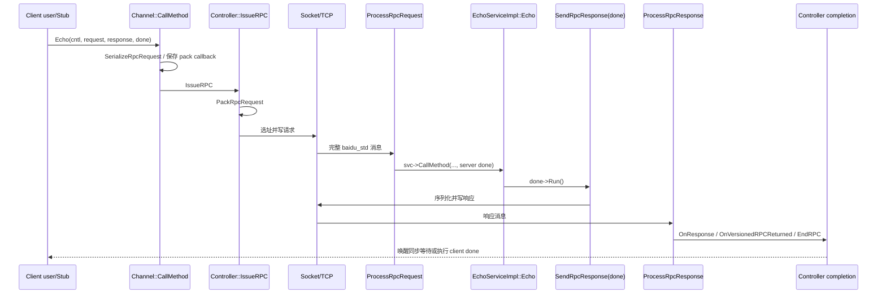

# 第 3 周：追踪一次 RPC 的完整生命周期

> 导航：[八周总计划](learning-plan.md) · [上一周：API 与生命周期](02-api-and-lifetime.md) · [下一周：I/O 与 IOBuf](04-io-and-iobuf.md)
>
> 建议投入：6–8 小时，分 5 次完成。本页只规划阅读与实验；执行记录写入 `notes/records/week-03.md`，调试器命令和原始输出放入 `build/learning-records/week-03/`。

## 本周完成标准

本周只追踪主线 `Echo + baidu_std + TCP`。完成后应能从 Stub 讲到服务端业务，再讲回客户端完成；区分请求序列化与协议打包，以及用户 `log_id` 与框架 `correlation_id`。

还应能解释 `ProcessRpcRequest` 的分发、`ProcessRpcResponse` 的匹配与解析、同步/异步完成的分流，以及超时与迟到响应如何通过版本化 `CallId` 隔离。

## 前置条件和实验基线

- 第 2 周学习副本可构建，保留有限次数客户端；异步调用前保存 `CallId`，回调不访问已释放对象。
- 主库使用调试符号；以 `compile_commands.json` 的实际优化参数为准。本周将 event dispatcher、transport 和 IOBuf 内部结构留到第 4 周。

准备记录目录并重建相关产物；使用 `tee` 的每个 zsh 终端先启用 `pipefail`：

```bash
mkdir -p build/learning-records/week-03 notes/records
set -o pipefail
cmake --build build/learning --target brpc-static brpc_channel_unittest --parallel 6
cmake --build build/learning-lab --parallel 4
```

## 一张先猜后证的路径图



图中的 `Socket/TCP` 是本周暂时折叠的层，不代表一次 write/read 等于一个 RPC 包。

## 源码阅读地图

| 阶段 | 文件与符号 | 本周要留下的证据 |
| --- | --- | --- |
| API 入口 | [channel.cpp](../src/brpc/channel.cpp) `Channel::CallMethod` | 参数校验、Controller 初始化、同步/异步标志、何处进入 `IssueRPC` |
| 请求序列化 | [baidu_rpc_protocol.cpp](../src/brpc/policy/baidu_rpc_protocol.cpp) `SerializeRpcRequest` | Protobuf body 如何形成，缺失 required 字段如何失败 |
| 发起/发送 | [controller.cpp](../src/brpc/controller.cpp) `Controller::IssueRPC` | 选址、pack 回调、Socket 写入与失败回流 |
| 协议打包 | [baidu_rpc_protocol.cpp](../src/brpc/policy/baidu_rpc_protocol.cpp) `PackRpcRequest` | IssueRPC 何时调用它；service/method、`log_id`、`correlation_id` 如何进入 `RpcMeta` |
| 服务端解析 | [baidu_rpc_protocol.cpp](../src/brpc/policy/baidu_rpc_protocol.cpp) `ParseRpcMessage`、`ProcessRpcRequest` | 完整消息判断、方法查找、请求反序列化 |
| 业务/回包 | 同文件 `svc->CallMethod`、`SendRpcResponse` | server done 捕获哪些状态，何时序列化 response |
| 客户端解析 | 同文件 `ProcessRpcResponse` | 从 meta 得到 cid、`bthread_id_lock`、错误或 response 解析 |
| 完成 | [controller_private_accessor.h](../src/brpc/details/controller_private_accessor.h) `OnResponse`；[controller.cpp](../src/brpc/controller.cpp) `OnVersionedRPCReturned`、`EndRPC` | 重试判断、版本校验、回调/同步唤醒、资源回收 |
| 协议结构 | [baidu_rpc_meta.proto](../src/brpc/policy/baidu_rpc_meta.proto) `RpcMeta`、`RpcRequestMeta`、`RpcResponseMeta` | `correlation_id` 与 `log_id` 所属层次 |

## 学习单元 1（75–90 分钟）：调用入口与请求编码

### 阅读顺序

1. 从学习副本 `example/learning_echo_c++/client.cpp` 的 `stub.Echo` 开始，并链接回[原始客户端](../example/echo_c++/client.cpp)核对基线，确认生成 Stub 最终调用 Channel。
2. 精读 `Channel::CallMethod`，只跟本周 `baidu_std` 正常路径；记录 `method`、`cntl_base`、request、response、done 的去向。
3. 找到协议对象提供的 `serialize_request` 和 `pack_request` 回调：前者在 `CallMethod` 执行，后者保存后由 `IssueRPC` 调用。
4. 对照 [baidu_std 文档](../docs/cn/baidu_std.md) 和 `RpcMeta` proto，不延伸到其他协议实现。

### 带问题的操作

1. `SerializeRpcRequest` 包含什么；attachment 在哪个阶段拼接？`PackRpcRequest` 为何需要 MethodDescriptor？
2. `cntl.set_log_id(42)` 进入哪个字段；`correlation_id` 是否来自它？用赋值语句证明。
3. request 未初始化时为何可在写 Socket 前结束；失败如何回到统一完成路径？

### 观察与记录

- 画一张“Protobuf request → request body → RpcMeta + body + attachment”的逻辑布局图。
- 每个箭头标函数名；不猜测内存是否复制，第 4 周再结合 IOBuf 判断。
- 摘录不超过必要范围的关键条件，并写自己的解释，避免整段复制源码。

## 学习单元 2（75–90 分钟）：IssueRPC、服务端分发与 server done

### 阅读顺序

1. `Controller::IssueRPC`：跟踪本周单一地址、无重试的正常分支，记录 Socket 选择、请求打包和写入的先后关系。
2. `ParseRpcMessage`：只回答消息不完整、协议头非法、完整消息三种结果如何表达。
3. `ProcessRpcRequest`：定位 server、Service、Method、Controller、request/response messages 的建立。
4. 找到 `NewCallback(&SendRpcResponse, ...)` 和紧随其后的 `svc->CallMethod(...)`。
5. 回到学习副本 `example/learning_echo_c++/server.cpp` 的 `Echo`，并链接回[原始服务端](../example/echo_c++/server.cpp)核对基线，连接 `ClosureGuard` 析构与 `SendRpcResponse`。

### 带问题的操作

1. “已写入 Socket”是否等于“服务端已收到”？服务端按什么名字查找 Service/Method？
2. server done 为何捕获 correlation id、Controller、消息对象和 Server？
3. `svc->CallMethod` 是否跨网络；`Echo` 返回是否等于响应发送完成？

### 记录

- 为服务端对象写释放清单：输入消息、Controller、request、response、server done 分别在哪条路径交接。
- 标出 `cntl.release()` 的意义：从局部智能指针移交，并非释放 Controller 内存。

## 学习单元 3（75–90 分钟）：响应匹配与完成语义

### 阅读顺序

1. 精读 `ProcessRpcResponse`：解析 `RpcMeta`，由 correlation id 构造 `bthread_id_t`，调用 `bthread_id_lock`。
2. 观察锁定失败分支：为什么 `EINVAL`/`EPERM` 不一定是服务故障？
3. 进入 `ControllerPrivateAccessor::OnResponse`，再跳到 `Controller::OnVersionedRPCReturned`。
4. 在 `OnVersionedRPCReturned` 中区分版本不匹配、可能重试、最终完成三类路径。
5. 精读 `Controller::EndRPC` 中同步与异步分支，并回看 `Channel::CallMethod` 的同步等待收尾。

### 带问题的操作

1. response 到达时为何不能直接使用裸 Controller 指针；`saved_error` 为何在版本检查失败时恢复？
2. 异步 done 在哪里执行，同步调用在哪里恢复；`unlock_and_destroy` 销毁的是什么关联？
3. 超时先销毁旧版本 CallId 后，迟到 response 的 `bthread_id_lock` 会发生什么？

### 本单元产出

在 `week-03.md` 写一条从 `EchoService_Stub::Echo` 到 `Controller::EndRPC`、不少于 12 个符号的成功链；给每个符号标注所在进程，以及直接调用、网络或调度/完成边界。

## 学习单元 4（100–120 分钟）：三个实验

### 实验一：用 log_id 串起低频成功请求

目标：证明业务 `log_id` 的传播，并观察完整成功路径；不把它误当 correlation id。

步骤：

1. 限定一次请求、`max_retry=0`，把起始 `log_id` 设为 4200；两端打印 log id，客户端在对象有效时打印 `call_id().value`。
2. 使用 `timeout_ms=-1`，在 `PackRpcRequest` 与 `ProcessRpcRequest` 分别观察 correlation id 与 log id；断点停顿不能混入超时测量。
3. 保存请求日志和断点观察；不要把对象地址当成稳定协议标识。

成功预期：两端业务日志均看到 4200，correlation id 来自独立的框架赋值；二者数值偶然相等也不能推导语义相同。失败边界：若优化导致局部变量不可见，优先调整断点；必须加框架临时日志时，单独记录补丁，实验后恢复并重建主库。

### 实验二：比较同步与异步完成

目标：观察同一网络路径在客户端完成方式上的分叉。

步骤：

1. 同步模式用 `done == nullptr`；异步模式调用前保存 cid，分别记录调用前后、回调进入/离开和 Join 返回。
2. 每种模式发 3 次且 `max_retry=0`，比较网络/服务端符号、`EndRPC` 和 `CallMethod` 尾部行为。
3. 各多跑两次，区分某次日志顺序与源码保证。

成功预期：两种模式都得到响应；同步调用返回时结果可读，异步以 done/Join 作为完成边界。失败边界：异步回调未发生时先检查生命周期和服务端 done，再检查网络。

### 实验三：超时与迟到响应

目标：沿版本化 CallId 解释先超时、后到响应。

在学习服务端新增或复用统一学习参数 `--study_delay_ms`（默认 0），在业务处理前受控延迟；此参数是待实现练习。客户端使用 `--timeout_ms=20 --max_retry=0`，服务端使用 `--study_delay_ms=100`。

步骤：

1. 先用延迟 0 建立基线，再以延迟 100ms、超时 20ms 记录错误码、耗时和回调次数。
2. 超时后等待 200ms；先无断点采集耗时，再在 lock 失败分支用条件断点单独观察机制。
3. 对照 `ChannelTest.timeout`，解释迟到响应没有再次完成用户调用。

成功预期：用户回调只执行一次且为超时；迟到响应被版本/锁检查拒绝。失败边界：如果延迟使用阻塞整个进程的错误方式，会混入调度问题；本周只把延迟放在单次请求业务路径，第 5 周再讨论 worker 阻塞。

### 建议运行命令

终端 A：服务端持续运行，实验结束后按 Ctrl-C。

```bash
set -o pipefail
./build/learning-lab/echo_server --listen_addr=127.0.0.1:8000 \
  --study_delay_ms=100 2>&1 | tee build/learning-records/week-03/server-timeout.log
```

终端 B：客户端有限次运行后退出。

```bash
set -o pipefail
./build/learning-lab/echo_client --server=127.0.0.1:8000 \
  --timeout_ms=20 --max_retry=0 --study_request_count=1 2>&1 | \
  tee build/learning-records/week-03/client-timeout.log
```

macOS 调试器可使用 LLDB：

```bash
lldb -- ./build/learning-lab/echo_client --server=127.0.0.1:8000 \
  --timeout_ms=-1 --max_retry=0 --study_request_count=1
```

进入 LLDB 后按符号设断点，例如 `breakpoint set --name brpc::Channel::CallMethod`。模板/匿名命名空间符号匹配失败时先用 `image lookup -rn PackRpcRequest` 查询实际符号名，不盲猜地址。

## 学习单元 5（60–75 分钟）：针对性测试、时序图与闭卷讲解

### 测试命令

```bash
cmake --build build/learning --target brpc_channel_unittest --parallel 6 2>&1 | \
  tee build/learning-records/week-03/build-channel-test.log
(
  cd build/learning/test
  ./brpc_channel_unittest --gtest_list_tests
  ./brpc_channel_unittest \
    --gtest_filter='ChannelTest.success:ChannelTest.timeout'
) 2>&1 | tee build/learning-records/week-03/channel-test.log
```

阅读 [brpc_channel_unittest.cpp](../test/brpc_channel_unittest.cpp) 中 `ChannelTest.success` 与 `ChannelTest.timeout`。注意两个顶层用例内部又覆盖单点/负载均衡、同步/异步、短连接组合；记录实际断言失败的组合，而非只看顶层名称。

有效结果应显示两个过滤用例确实运行。若测试失败，先保存第一个失败、端口/线程环境和完整过滤条件；0 tests 不是通过。

### 最终图表要求

在记录中交付成功路径图（至少 12 个关键符号和各类边界）与超时叠加图（timeout、完成、单次回调和迟到响应锁定失败）。

闭卷讲一次成功 RPC，并回答：两种 id 的设置者和用途、两种 done 所在侧、反序列化后还需哪些完成动作、同步等待在哪里结束，以及迟到响应为何不能误完成复用后的 Controller。

## 常见误区与纠偏

| 误区 | 纠偏动作 |
| --- | --- |
| 把 Stub 当作网络实现 | 跳到生成 Stub 对 Channel 的转发，再进入 `CallMethod` |
| 把序列化和协议打包混为一谈 | 分别记录 body 与 `RpcMeta`/头部的构造 |
| `log_id == correlation_id` | 对照 proto 所属 message 和 `PackRpcRequest` 的两次赋值 |
| `svc->CallMethod` 是一次网络调用 | 标注它是服务端进程内对业务方法的分发 |
| Service 返回就代表客户端收到响应 | 继续跟 `SendRpcResponse`、Socket 写和客户端解析 |
| 超时后迟到响应靠业务 log id 丢弃 | 跟踪版本化 correlation id 与 `bthread_id_lock` |
| 断点顺序就是唯一线程顺序 | 分开记录调用关系与某次调度观测，多次复现 |
| 本周需要读完 Socket 和 IOBuf | 保持折叠边界，第 4 周再补 event/transport/buffer |

## 本周验收清单

- [ ] 能闭卷说出不少于 12 个成功路径关键符号及其所在文件。
- [ ] 能分别解释 `SerializeRpcRequest` 与 `PackRpcRequest` 的输入输出。
- [ ] 路径图标出了客户端进程、服务端进程、网络边界和完成边界。
- [ ] 一次低频请求记录了业务 `log_id` 和框架 `correlation_id`，没有把对象地址当协议 ID。
- [ ] 同步与异步实验都有限次退出，且生命周期符合第 2 周契约。
- [ ] 超时实验设置 `max_retry=0`，用户回调只完成一次，并给迟到响应留下观察窗口。
- [ ] 能沿源码解释版本不匹配或 lock 失败如何阻止迟到响应重复完成。
- [ ] `ChannelTest.success:ChannelTest.timeout` 实际运行且通过，或有完整、可复现的阻塞记录。
- [ ] 持久练习改动仅留在学习副本；如为机制观察临时修改过框架，补丁已恢复并重建主库。
- [ ] 记录和日志分别位于 `notes/records/week-03.md` 与 `build/learning-records/week-03/`。

## 复盘问题与第 4 周衔接

1. `Socket::Write` 接收 IOBuf 后，数据是否立刻进入内核？拥塞时发生什么？
2. TCP read 为什么可能只拿到半个 RPC，或一次拿到多个 RPC？
3. `ParseRpcMessage` 如何在“不完整消息”和“非法消息”之间作区分？
4. request body、attachment 和协议 meta 在 IOBuf 中是否复制、共享还是移动？
5. 从 socket 可读事件到 `ProcessRpcRequest`/`ProcessRpcResponse`，还经过哪些 transport 与 messenger 层？

带着本周的折叠 `Socket/TCP` 节点进入[第 4 周](04-io-and-iobuf.md)。下一周把它展开为 event dispatcher → `Socket::OnInputEvent` → transport → `InputMessenger` → protocol parser，并用 IOBuf 实验核对复制与共享边界。
