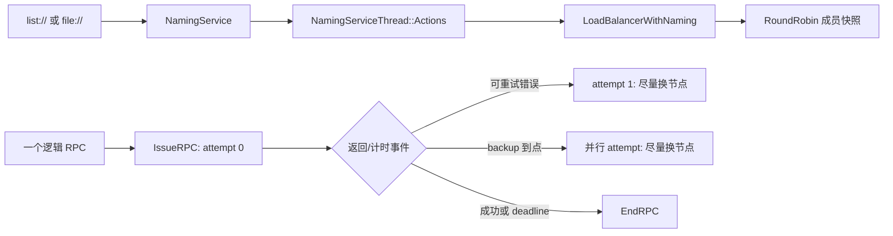

# 第 6 周：服务发现、负载均衡与故障处理

> 导航：[总计划](learning-plan.md) · [上一周：bthread](05-bthread.md) · [下一周：可观测性与性能](07-observability-and-performance.md)

本周投入 **6–8 小时**。目标不是背负载均衡算法，而是把“成员从哪里来、一次调用选了谁、失败后为什么会再发一次”拆成三条能沿源码解释的链路。所有实验均为待执行任务；本文只给步骤和判定方法，不表示已经运行通过。

## 前置条件与本周产物

- 已完成第 2 周实验副本 `example/learning_echo_c++/`，包含 `client.cpp`、`server.cpp`、`echo.proto`、`CMakeLists.txt`。
- 主工程测试构建目录为 `build/learning/`，实验副本构建目录为 `build/learning-lab/`。
- 能从第 3 周笔记指出 `Channel::CallMethod`、`Controller::IssueRPC`、`OnVersionedRPCReturned`。
- 能从第 5 周解释等待 RPC 的 bthread 为什么不等于一直占住一个 pthread worker。
- 本周只使用 loopback：`127.0.0.1:8000` 和 `127.0.0.1:8001`。
- 执行记录写入 `notes/records/week-06.md`，原始日志放入 `build/learning-records/week-06/`。

本周交付物：一张路由链路图、一张至少四场景的故障矩阵，以及一份能区分逻辑请求和实际 attempt 的实验记录。

## 本周目标

完成后应能：

1. 解释 `list://` 或 `file://` 如何经 `NamingServiceThread` 更新负载均衡器的成员。
2. 解释 `rr` 如何避开已尝试节点，以及找不到可用节点时返回什么。
3. 区分连接超时、RPC deadline、普通重试和 backup request。
4. 用 `retried_count()`、`has_backup_request()`、服务端计数和日志一起估算 attempt 数。
5. 说明默认重试策略为何保守，以及有副作用的业务为何必须自行保证幂等。

## 源码阅读地图

| 层次 | 精读入口与符号 | 阅读时回答 |
| --- | --- | --- |
| 用户配置 | [channel.h](../src/brpc/channel.h) `ChannelOptions`、`Channel::Init` | `connect_timeout_ms`、`timeout_ms`、`backup_request_ms`、`max_retry` 分别约束什么？ |
| 名称到节点 | [naming_service.h](../src/brpc/naming_service.h) `NamingService::RunNamingService`、`NamingServiceActions` | 实现如何发布新增、删除或全量节点？ |
| 成员变更 | [naming_service_thread.cpp](../src/brpc/details/naming_service_thread.cpp) `NamingServiceThread::Actions::ResetServers` | 节点怎样去重、求差、转换成 `ServerId` 并通知 watcher？ |
| 连接命名与 LB | [load_balancer_with_naming.cpp](../src/brpc/details/load_balancer_with_naming.cpp) `Init`、`OnAddedServers`、`OnRemovedServers` | 命名服务更新和每次请求选址为何是两条路径？ |
| 单次选址 | [round_robin_load_balancer.cpp](../src/brpc/policy/round_robin_load_balancer.cpp) `RoundRobinLoadBalancer::SelectServer` | `ExcludedServers`、可用性检查、最后一次机会分别做什么？ |
| 发起 attempt | [controller.cpp](../src/brpc/controller.cpp) `Controller::IssueRPC` | 何时选节点、加入排除集、打包和写 socket？ |
| attempt 返回 | [controller.cpp](../src/brpc/controller.cpp) `OnVersionedRPCReturned`、`EndRPC` | 错误如何进入重试、backup 或最终完成？ |
| 重试判定 | [retry_policy.h](../src/brpc/retry_policy.h) `RetryPolicy::DoRetry`；[retry_policy.cpp](../src/brpc/retry_policy.cpp) `RpcRetryPolicy::DoRetry` | 哪些错误默认可重试？成功或业务失败是否默认重试？ |
| 行为证据 | [brpc_channel_unittest.cpp](../test/brpc_channel_unittest.cpp) `ChannelTest.timeout/retry/retry_other_servers/backup_request` | 测试怎样制造不同失败并断言调用次数？ |

建议画成下面三段，而不是把一切画进一条调用栈：



## 学习单元 1（75 分钟）：建立超时与重试的精确定义

**阅读（35 分钟）**

- [client.md](../docs/cn/client.md) 的“超时”“重试”“backup request”“重试应当保守”和“幂等”段落。
- [backup_request.md](../docs/cn/backup_request.md) 的工作机制和阈值选择。
- [channel.h](../src/brpc/channel.h) 中 `ChannelOptions` 前半部分。
- [controller.h](../src/brpc/controller.h) 中 `retried_count()`、`has_backup_request()`、`latency_us()`。

**带问题操作（25 分钟）**

1. 在记录中画四个独立旋钮：连接建立 deadline、整个 RPC deadline、backup 触发点、最多重试次数。
2. 写出三个不等式示例：`backup_request_ms >= timeout_ms`、连接很快建立但业务很慢、端口无人监听。
3. 对每个示例预测 `ErrorCode()` 类型、是否可能重试、是否可能发 backup；先写预测，本周实验后再订正。
4. 从 `RpcRetryPolicy::DoRetry` 抄录错误类别而非只抄数字，并特别标记源码注释中的 `ETIMEDOUT` 不是整个 RPC 超时。

**观察与记录（15 分钟）**

- `ERPCTIMEDOUT` 表示整个 RPC deadline，deadline 到达即结束，不能再靠重试挽救。
- `ETIMEDOUT` 在此语境表示连接超时，位于默认可重试集合。
- `max_retry` 不包含第一次 attempt；backup 会消耗一次重试次数。
- 一个逻辑请求可能造成多个服务端执行；客户端只接受先完成的有效结果，并不等于其他 attempt 被服务端取消。

## 学习单元 2（80 分钟）：成员更新与 round-robin 选址

**阅读（40 分钟）**

- [load_balancing.md](../docs/cn/load_balancing.md) 的命名服务 URL 和负载均衡调用方式。
- [naming_service.h](../src/brpc/naming_service.h) 全部公开接口。
- [naming_service_thread.cpp](../src/brpc/details/naming_service_thread.cpp) `ResetServers`。
- [load_balancer_with_naming.cpp](../src/brpc/details/load_balancer_with_naming.cpp) 全文件。
- [round_robin_load_balancer.cpp](../src/brpc/policy/round_robin_load_balancer.cpp) `SelectServer`。

**带问题操作（25 分钟）**

1. 用两种颜色在图上标注：成员更新是低频控制路径，`SelectServer` 是每次 attempt 的数据路径。
2. 追踪 `ServerNode → ServerId → Socket`，说明负载均衡器保存的为什么不是文本地址列表。
3. 找出 `SelectServer` 返回 `ENODATA` 与 `EHOSTDOWN` 的条件，并写出两者对故障定位的不同含义。
4. 解释 `ExcludedServers::IsExcluded` 为什么只能“尽量”换节点：候选耗尽时，代码保留最后机会。

**观察与记录（15 分钟）**

- 记录 `list://` 是静态列表还是动态轮询；`file://` 修改后何时被观察到要以实际实验为准。
- 不把“请求数约 50/50”写成逐次严格交替；当前 `rr` 使用线程局部 offset/stride，并随机化初始 offset。
- 成员列表中的节点和当下可用节点是两个概念，健康状态可让选址跳过某节点。

## 学习单元 3（105 分钟）：准备实验副本并验证双实例路由

这一单元需要在学习副本中新增实验能力。以下 flags **不是原始 Echo 已有参数**，先实现并赋值，再运行命令：

- 服务端 `--study_delay_ms`，`int32`，默认 `0`；在 `Echo` 中响应前延迟指定毫秒。
- 服务端 `--study_fail`，`bool`，默认 `false`；开启时沿用第 2 周的 `cntl->SetFailed(brpc::EINTERNAL, ...)`，该错误不在默认重试集合。
- 客户端 `--study_backup_request_ms`，`int32`，默认 `-1`；在 `channel.Init` 前赋给 `options.backup_request_ms`。
- 客户端 `--study_request_count`，默认 `1`；按第 2 周实现逐次发起并 Join，达到数量后退出。
- 客户端每次打印 `log_id`、`remote_side()`、`ErrorCode()`、`latency_us()`、`retried_count()`、`has_backup_request()`。

**实现和构建检查（40 分钟）**

1. 修改 `example/learning_echo_c++/server.cpp` 和 `client.cpp`，不要改原始 `example/echo_c++/`。
2. `study_delay_ms < 0` 时启动即报错退出；延迟用 `bthread_usleep`，避免把实验误变成 pthread 阻塞案例。
3. 保留 `server`、`load_balancer`、`timeout_ms`、`max_retry`、`interval_ms` 可配置；`study_request_count` 必须准确限制逻辑请求数。
4. 重新构建实验副本：`cmake --build build/learning-lab -j6`。
5. 若构建失败，将编译命令和首个根因写入记录，不继续伪造运行结果。

**实验 A：静态双实例分布（35 分钟）**

终端 A：

```bash
mkdir -p build/learning-records/week-06
build/learning-lab/echo_server --listen_addr=127.0.0.1:8000 \
  --study_delay_ms=0 >build/learning-records/week-06/server-8000.log 2>&1
```

终端 B：

```bash
build/learning-lab/echo_server --listen_addr=127.0.0.1:8001 \
  --study_delay_ms=0 >build/learning-records/week-06/server-8001.log 2>&1
```

终端 C：

```bash
build/learning-lab/echo_client \
  --server=list://127.0.0.1:8000,127.0.0.1:8001 --load_balancer=rr \
  --timeout_ms=300 --max_retry=0 --interval_ms=20 --study_request_count=40
```

终端管理：服务端命令各自在独立终端运行，记录 PID；实验结束后用 `Ctrl-C` 正常停止。

成功预期：40 个逻辑请求均成功，两个 `remote_side` 都出现。失败预期：若只有一个地址，先检查实例是否真正监听以及 URL 是否被 shell 正确传入。边界：样本小或线程变化时不要求精确 20/20，只记录计数和偏差。

**实验 B：file 命名动态更新（30 分钟）**

1. 创建 `build/learning-records/week-06/server.list`，每行一个 `127.0.0.1:端口`，初始含两个实例。
2. 客户端改用 `--server=file://build/learning-records/week-06/server.list --load_balancer=rr`，发送有限但足够长的一组请求。
3. 运行期间删除 `8001` 那一行；记录最后一次命中 8001 和成员变化被观察到的时间。
4. 再加入该行，观察恢复；不要把轮询间隔猜成固定值，记录实测和相关 flag。

成功预期：成员更新后新请求最终只选现存成员，恢复后 8001 最终重新出现。失败预期：相对路径受工作目录影响或写入格式不对。边界：已发出的 attempt 不会因成员列表刚更新就被撤销。

## 学习单元 4（110 分钟）：构造故障矩阵与 backup 对照

**实验 C：四类故障（65 分钟）**

保持客户端参数可见，每组至少发送 20 个逻辑请求：

| 场景 | 服务端设置/动作 | 客户端建议 | 主要观察 |
| --- | --- | --- | --- |
| 基线 | 两端均 `study_delay_ms=0` | `timeout=300,max_retry=0,backup=-1` | 每请求 1 attempt |
| 慢实例 | 8000 延迟 150ms，8001 为 0 | `timeout=300,max_retry=0,backup=-1` | 慢请求仍可成功，不因“慢”自动重试 |
| 连接拒绝 | 列表保留 8001，但停止其进程 | `timeout=300,max_retry=1,backup=-1` | 传输错误可能触发换节点重试 |
| RPC deadline | 两端延迟 300ms | `timeout=80,max_retry=3,backup=-1` | `ERPCTIMEDOUT` 后结束，不应期待 3 次重试 |
| 显式失败 | 8000 `study_fail=true` | `timeout=300,max_retry=1,backup=-1` | `EINTERNAL` 不在默认重试集合，预期不重试 |

每组客户端命令显式传 `--study_request_count=20 --interval_ms=20`，以及表中的 timeout、retry、backup 参数。停止发起后等待所有 inflight attempt 排空，再记录：逻辑请求数、成功/失败数、错误码分布、`retried_count()` 总和、两端服务端处理次数和端到端耗时。不要用 `retried_count()+1` 草率等同服务端执行数：写出后未到达、backup 并发和日志丢失都可能造成差异。

每切换一行都重启实例或显式复位 `study_delay_ms=0`、`study_fail=false`，并在日志中写下实际启动参数，避免上一组故障注入污染下一组基线。

**backup 对照（35 分钟）**

1. 8000 设置 `--study_delay_ms=150`，8001 设置 `0`。
2. 先用 `--study_backup_request_ms=-1 --max_retry=1 --timeout_ms=300 --study_request_count=40 --interval_ms=20` 跑一组。
3. 再用 `--study_backup_request_ms=40 --max_retry=1 --timeout_ms=300 --study_request_count=40 --interval_ms=20` 跑同样请求数。
4. 比较 `has_backup_request()`、两个服务端处理次数、成功率和延迟分布。
5. 停止发起并等待 inflight 排空后统计两端执行数。再将 backup 设为 `400`（大于 deadline）验证其不触发；将 `max_retry=0` 作为边界，记录实际行为并回读测试解释。

成功预期：满足慢实例和阈值条件时，部分逻辑请求出现 backup，且服务端总处理数可能大于逻辑请求数。失败预期：backup 阈值没到、先选快节点或没有剩余重试次数时不触发。结论边界：有限样本不保证 p99 改善；backup 也可能只增加后端负载。

**幂等推演（10 分钟）**

假设 Echo 改成“账户余额 +1”：给每个逻辑请求一个稳定业务 request-id，多个 attempt 必须携带同一 ID，服务端存储已处理 ID 并返回原结果。`log_id` 可帮助观察，但不要未经业务契约就把它当全局幂等键。

## 学习单元 5（75 分钟）：用单测收口机制

从仓库根执行；这些命令假设第 1 周已在 `build/learning` 开启单测并完成构建：

```bash
cmake --build build/learning --target \
  brpc_channel_unittest brpc_load_balancer_unittest -j6
(cd build/learning/test && ./brpc_channel_unittest \
  --gtest_filter='ChannelTest.timeout:ChannelTest.retry:ChannelTest.retry_other_servers:ChannelTest.backup_request')
(cd build/learning/test && ./brpc_load_balancer_unittest \
  --gtest_filter='LoadBalancerTest.fairness')
```

**测试前阅读（30 分钟）**

- 在 [brpc_channel_unittest.cpp](../test/brpc_channel_unittest.cpp) 定位上述四个测试，写下 fixture 如何制造超时、错误和服务端选择。
- 在 [brpc_load_balancer_unittest.cpp](../test/brpc_load_balancer_unittest.cpp) 定位 `LoadBalancerTest.fairness`，确认它衡量的是何种公平性，不把单测环境外推成生产 SLA。

**执行与记录（25 分钟）**

- 保存完整命令、退出码、通过/失败用例和耗时。
- 具体 target 不存在时检查 `BUILD_UNIT_TESTS=ON`，不要用全量构建掩盖配置问题。
- 环境失败与断言失败分开记录；本文不声称这些测试已经运行。

**源码回扣（20 分钟）**

对每个测试写一条“输入事件 → 判定符号 → 最终状态”，至少引用 `IssueRPC`、`RpcRetryPolicy::DoRetry`、`SelectServer`、`OnVersionedRPCReturned` 中三个。

## 常见误区

- 把 `connect_timeout_ms` 当整个 RPC 超时；它只约束连接建立阶段，并受总 deadline 限制。
- 把慢响应当可重试错误；连接正常而服务端一直不回时，默认普通重试不会因“慢”自动发生。
- 认为 `max_retry=3` 表示最多 3 次总发送；它表示首次发送之外最多再重试 3 次。
- 认为 backup 是取消并迁移原请求；原 attempt 可能继续执行并产生副作用。
- 认为一个成功响应证明业务只执行一次；重试或 backup 均可能导致重复执行。
- 用单次 50/50 分布证明 round-robin 正确；应查看样本、初始 offset 和可用节点变化。
- 把命名服务更新延迟与一次负载均衡选址耗时混为一谈。
- 直接给原始 Echo 传 `--study_*`；这些 flags 必须先在学习副本实现。

## 验收清单

- [ ] 完成路由图，能区分成员更新路径和每次 attempt 的选址路径。
- [ ] 能从源码指出 `ENODATA`、`EHOSTDOWN` 产生条件。
- [ ] 能准确解释连接超时、RPC deadline 和 backup 阈值。
- [ ] 能列出默认可重试错误的类别，并说明业务失败为何通常不在其中。
- [ ] 双实例实验记录包含两端命中计数，而非只写“看起来均衡”。
- [ ] `file://` 实验记录成员删除和恢复的实测时间。
- [ ] 故障矩阵至少覆盖正常、慢响应、连接拒绝、RPC deadline。
- [ ] backup 对照同时记录延迟、成功率和额外服务端执行数。
- [ ] 明确区分逻辑请求数、客户端 attempt 数和服务端执行数。
- [ ] 精确过滤的单测有命令、退出码和结果；未运行则明确记录阻塞原因。
- [ ] 执行记录保存于 `notes/records/week-06.md`，日志位于指定目录。

## 复盘问题

1. 一个节点从 `file://` 删除后，哪些已发生动作不会被回滚？
2. 为什么默认重试策略对持续变慢但连接不断的服务帮助有限？
3. backup 赢得响应后，原 attempt 可能处于哪些状态？业务如何处理重复副作用？
4. `ExcludedServers` 为什么是 best effort，而不是绝对保证选新节点？
5. 故障矩阵中哪一项仅凭客户端错误日志最容易误判？还需要什么证据？
6. 若 backup 后 p99 降低但服务端请求量上升 30%，你还缺哪些数据才能决定是否启用？

## 与第 7、8 周衔接

保留本周新增的 `study_delay_ms`、`study_fail`、`study_backup_request_ms`，以及第 2 周已有的 `study_request_count`。第 7 周将给同一实验台增加 bvar 与 rpcz，用指标验证“慢在哪里”；第 8 周继续复用相同参数契约，不另造一套不兼容的 flags。

进入下一周前，在故障矩阵中圈出一个尚无法仅靠日志解释的场景，写下希望通过 `/vars` 或 rpcz 看到的证据。
