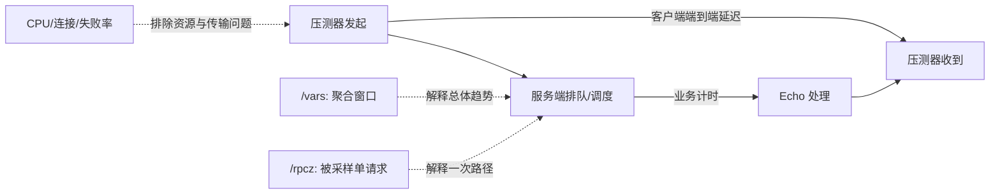

# 第 7 周：可观测性与性能诊断

> 导航：[总计划](learning-plan.md) · [上一周：路由与故障](06-routing-and-failures.md) · [下一周：综合实验与复盘](08-capstone-and-review.md)

本周投入 **6–8 小时**。主线是建立一套能回答“慢在哪里、失败在哪里、结论是否可重复”的最小证据链。实验仍在 `example/learning_echo_c++/` 上进行；本文仅提供计划，没有实际构建、运行或性能结论。

## 前置条件与本周产物

- 第 6 周双实例实验可启动在 `127.0.0.1:8000`、`127.0.0.1:8001`。
- 学习副本已实现服务端 `--study_delay_ms`（默认 0）、`--study_fail`（默认 false）。
- 客户端已实现 `--study_backup_request_ms`（默认 -1，并赋给 `ChannelOptions.backup_request_ms`）和 `--study_request_count`（默认 1）。
- 主工程构建目录是 `build/learning/`，实验副本构建目录是 `build/learning-lab/`。
- 第 6 周能够区分一个逻辑 RPC 和多个 attempt，不能用客户端成功数代替服务端执行数。
- 本周记录写入 `notes/records/week-07.md`，原始数据与日志放入 `build/learning-records/week-07/`。

本周交付物是一份可复现诊断报告，至少包含：环境、假设、指标边界、命令、原始数据、重复测量、观察、结论与未证明事项。

## 本周目标

完成后应能：

1. 解释 `Adder`、窗口统计与 `LatencyRecorder` 的职责和聚合边界。
2. 从 `/vars` 识别 count、qps、平均延迟、最大延迟、分位数和 CDF。
3. 用 rpcz 将一次请求拆成可定位的时间段，并与第 3 周时序图对照。
4. 设计包含预热、固定测量窗口和至少三次重复的对照实验。
5. 区分服务端业务耗时、客户端端到端耗时、失败率和客户端压测瓶颈。
6. 在数据不足时写“未证明”，避免承诺 backup 或某项改动必然降低 p99。

## 源码阅读地图

| 关注点 | 精读入口与符号 | 要回答的问题 |
| --- | --- | --- |
| 分散写入 | [reducer.h](../src/bvar/reducer.h) `Adder`、`Reducer`；[window.h](../src/bvar/window.h) `Window` | 多线程写入如何汇总？窗口值与累计值有何区别？ |
| 合并基础 | [combiner.h](../src/bvar/detail/combiner.h) `AgentCombiner` | 每线程 agent 与全局结果怎样组合？读写成本偏向哪边？ |
| 延迟组合指标 | [latency_recorder.h](../src/bvar/latency_recorder.h) `LatencyRecorder` | 一次 `operator<<` 更新哪些子指标？单位由调用者如何约定？ |
| 暴露实现 | [latency_recorder.cpp](../src/bvar/latency_recorder.cpp) `expose`、`operator<<`、`latency_percentile`、`qps` | 名称如何生成？窗口 qps 怎样计算？暴露失败如何回滚？ |
| 服务端方法指标 | [method_status.h](../src/brpc/details/method_status.h) `MethodStatus` | 框架方法级别已有何种延迟/错误统计？自定义指标还需回答什么？ |
| rpcz 数据模型 | [span.h](../src/brpc/span.h) `Span`、采样判断 | trace/span 收集受哪些开关和采样条件影响？ |
| rpcz 页面 | [rpcz_service.cpp](../src/brpc/builtin/rpcz_service.cpp) `RpczService` | `/rpcz`、enable/disable 与过滤如何工作？ |
| 用户侧范例 | [multi_threaded_echo_c++/client.cpp](../example/multi_threaded_echo_c++/client.cpp) `g_latency_recorder` | 客户端怎样记录 `cntl.latency_us()` 并读取窗口 qps/latency？ |
| 行为证据 | [bvar_variable_unittest.cpp](../test/bvar_variable_unittest.cpp) `VariableTest.latency_recorder`；[bvar_reducer_unittest.cpp](../test/bvar_reducer_unittest.cpp) `ReducerTest.adder/window` | 暴露变量名和窗口语义如何被断言？ |

诊断关系先画成四个测量边界：



## 学习单元 1（80 分钟）：理解 bvar 的累计值与窗口值

**阅读（40 分钟）**

- [bvar.md](../docs/cn/bvar.md) 的设计目标、命名和内置页面。
- [bvar_c++.md](../docs/cn/bvar_c++.md) 中 `Adder`、`Window`、`LatencyRecorder`。
- [reducer.h](../src/bvar/reducer.h) 中 `Adder`/`Reducer`，[window.h](../src/bvar/window.h) 中 `Window`。
- [combiner.h](../src/bvar/detail/combiner.h) 中 `AgentCombiner`，只追踪写入 agent 与合并结果。

**带问题操作（25 分钟）**

1. 为以下问题分别选指标：进程以来总请求数、最近窗口 QPS、最近窗口平均耗时、最近窗口 p99、失败比例。
2. 写出“count 增加但 qps 已回到 0”的合理场景，说明二者时间边界不同。
3. 解释为何平均值无法替代分位数，分位数也无法告诉你失败请求去了哪里。
4. 找出 `LatencyRecorder::operator<<` 接受的是无单位 `int64_t`，记录本实验约定统一输入微秒。

**观察与记录（15 分钟）**

- 每个指标写清：生产位置、单位、累计/窗口、成功/全部请求、进程范围。
- 把 `/vars` 变量名当接口的一部分；重复 expose 同名变量可能失败，不能忽略返回值。
- bvar 的低写入开销不表示可以无边界创建高基数变量；本周只按实例/方法使用固定名称。

## 学习单元 2（90 分钟）：给实验服务增加最小指标

以下为学习中新增内容，不是原始 Echo 已有实现。

**指标设计（20 分钟）**

在 `EchoServiceImpl` 中增加：

- `bvar::Adder<int64_t> study_requests_total`：进入业务方法即加一，统计实际进入该业务方法的执行次数；解析或校验阶段拒绝的请求不计入。
- `bvar::Adder<int64_t> study_failures_total`：`study_fail` 分支加一。
- `bvar::LatencyRecorder study_business_latency`：记录 Echo 方法内部业务段耗时，单位明确为微秒。
- 可选分别暴露端口前缀，如 `learning_echo_8000_*`；确保两个进程变量名在各自进程内稳定即可。

业务计时边界从进入 `Echo` 后开始，到设置 response 或 `SetFailed` 前后约定的一处结束；不要把“服务端业务耗时”命名成“RPC 总耗时”。用 RAII 或单出口确保成功/失败路径都记录，但不要改变 `done` 恰好执行一次的契约。

**实现步骤（35 分钟）**

1. 阅读 [multi_threaded_echo_c++/client.cpp](../example/multi_threaded_echo_c++/client.cpp) 的 `LatencyRecorder` 用法。
2. 在学习副本添加必要头文件、成员和 expose；检查 expose 返回值。
3. 进入 Echo 时增加 request count，失败分支增加 failure count。
4. 用 `butil::cpuwide_time_us()` 或仓库既有计时方式记录业务段，向 recorder 写微秒值。
5. 保留第 6 周语义：`study_fail` 返回默认不重试的 `EINTERNAL`；不改参数名和默认值。
6. 构建：`cmake --build build/learning-lab -j6`。

**页面核对（35 分钟）**

```bash
mkdir -p build/learning-records/week-07
build/learning-lab/echo_server --listen_addr=127.0.0.1:8000 \
  --study_delay_ms=25 >build/learning-records/week-07/server-8000.log 2>&1
```

从另一终端抓取：

```bash
curl -s 'http://127.0.0.1:8000/vars' \
  > build/learning-records/week-07/vars-before.txt
```

从另一终端发送有限请求后再次保存 `/vars`。成功预期：request count 增量等于进入 Echo 业务方法的次数，业务延迟量级包含 25ms 注入延迟。失败预期：变量未出现时检查 expose 返回值和内置服务是否开启。边界：窗口 qps 会随采样时间变化，页面抓取瞬间不等于整段实验平均 QPS。

## 学习单元 3（80 分钟）：用 rpcz 解释一次请求

**阅读（30 分钟）**

- [builtin_service.md](../docs/cn/builtin_service.md) 的内置服务访问和安全提示。
- [rpcz.md](../docs/cn/rpcz.md) 的开启、列表和单请求明细。
- [span.h](../src/brpc/span.h) 的 `Span` 字段和采样判断。
- [rpcz_service.cpp](../src/brpc/builtin/rpcz_service.cpp) 中 `enable_rpcz`、列表与详情入口。

**实验步骤（35 分钟）**

1. 启动低频实例：`build/learning-lab/echo_server --listen_addr=127.0.0.1:8000 --study_delay_ms=50 --enable_rpcz=true --rpcz_database_dir=build/learning-records/week-07/rpcz-8000`。
2. 客户端执行 `build/learning-lab/echo_client --server=127.0.0.1:8000 --timeout_ms=1000 --max_retry=0 --study_backup_request_ms=-1 --study_request_count=5 --interval_ms=20`，避免时间线混入额外 attempt。
3. 访问 `http://127.0.0.1:8000/rpcz`，找到对应 method/log_id，再进入一次调用详情。
4. 将 rpcz 中的关键时间点映射回第 3 周图：请求到达、调度/业务、响应发送。
5. 保存页面信息或文本摘录到记录；若请求未被展示，检查开关、采样和保存条件，不声称 rpcz 捕获所有请求。

**观察与记录（15 分钟）**

- 对同一请求并列客户端 `latency_us()`、服务端 `study_business_latency` 样本量级和 rpcz 时间线。
- 差值是“业务外时间”的线索，不可直接命名为网络耗时；其中可能含排队、调度、协议处理和客户端工作。
- rpcz 是单请求样本，`/vars` 是聚合视图；二者互相补充，不能互相替代。

## 学习单元 4（120 分钟）：设计并执行可重复性能窗口

### 实验 A：注入延迟的校准实验（35 分钟）

固定单实例、请求内容、连接方式和客户端参数，依次设置服务端 `study_delay_ms=0/10/50`。每档：

1. 预热 10 秒，预热数据不计入结果。
2. 测量 30 秒，保存客户端成功/失败、端到端 p50/p99、服务端业务延迟、QPS、CPU 和连接数。
3. 重复至少 3 次，报告每次结果，不只选最好一次。
4. 验证业务延迟是否随注入量移动；端到端增量若明显不同，列出待查环节。

成功预期：指标边界和注入方向一致。失败预期：日志 I/O、客户端发送不足或计时位置错误会掩盖差异。边界：本地 loopback 结果只用于机制学习，不代表跨机生产性能。

### 实验 B：用 rpc_press 产生受控负载（45 分钟）

先阅读 [rpc_press.md](../docs/cn/rpc_press.md) 和 [rpc_press.cpp](../tools/rpc_press/rpc_press.cpp) 的 flags。该工具有 `--connection_timeout_ms`、`--lb_policy`、`--thread_num`，**没有** `backup_request_ms`；backup 实验必须继续使用学习副本客户端的 `--study_backup_request_ms`。

先构建已定义的具体目标，再使用 `tools/CMakeLists.txt` 约定的产物路径：

```bash
cmake --build build/learning --target rpc_press -j6
build/learning/output/bin/rpc_press \
  --server=127.0.0.1:8000 \
  --proto=example/learning_echo_c++/echo.proto \
  --method=example.EchoService.Echo \
  --input='{"message":"hello"}' \
  --protocol=baidu_std --connection_type=single \
  --timeout_ms=300 --connection_timeout_ms=100 --max_retry=0 \
  --qps=100 --thread_num=1 --duration=30
```

运行前用该二进制的 `--help` 核对参数。分别做低 QPS 和逐步升高 QPS 两档；每档预热、固定窗口、重复 3 次。成功预期：低档稳定，高档可能出现排队、失败或客户端饱和，也可能无明显瓶颈。配置失败应单独记录。边界：目标 QPS 不等于实际 QPS；`thread_num` 太小可能让客户端先成为瓶颈。

### 实验 C：backup 的收益与成本（40 分钟）

用第 6 周双实例：8000 注入 100ms，8001 为 0ms。若两端都启用 rpcz，分别传 `--rpcz_database_dir=build/learning-records/week-07/rpcz-8000` 和 `.../rpcz-8001`，避免共享 LevelDB 目录。只使用学习副本客户端，分别设 backup `-1` 和一个经基线 CDF 选择的正值；两组都显式传相同的请求次数、间隔、timeout 和 retry。

学习客户端是逐次 Join 的闭环串行模型，`interval_ms` 相同不代表固定输入 QPS；记录实际完成速率。保存每次 `cntl.latency_us()` 原始样本，明确 p50/p99 只统计成功请求还是包含失败完成。停止发起并等待 inflight 排空后，记录逻辑请求数、两端业务执行次数、成功率、业务延迟和 CPU；业务执行放大比不等于网络 attempt 比，因为有的尝试可能未到服务端。预热后固定窗口并重复 3 次。

成功判定不是“p99 必须下降”，而是数据完整且能说明：是否触发 backup、是否增加后端工作、延迟分布是否稳定变化。若 p99 没改善或波动大，结论写“当前窗口未证明改善”；若改善，也限制在本机、该延迟分布和该负载下。

## 学习单元 5（70 分钟）：单测与诊断报告收口

从仓库根执行，假设 `build/learning` 已启用单测：

```bash
cmake --build build/learning --target test_bvar brpc_builtin_service_unittest -j6
(cd build/learning/test && ./test_bvar \
  --gtest_filter='ReducerTest.adder:ReducerTest.window:VariableTest.latency_recorder')
(cd build/learning/test && ./brpc_builtin_service_unittest \
  --gtest_filter='BuiltinServiceTest.rpcz')
```

**测试阅读与执行（35 分钟）**

- 阅读 [bvar_reducer_unittest.cpp](../test/bvar_reducer_unittest.cpp) 的 `adder`、`window`，写出各自保护的语义。
- 阅读 [bvar_variable_unittest.cpp](../test/bvar_variable_unittest.cpp) 的 `latency_recorder`，列出 expose 后预期生成的变量名。
- 阅读 [brpc_builtin_service_unittest.cpp](../test/brpc_builtin_service_unittest.cpp) 的 `rpcz`，注意它验证页面/开关行为，不等于你的实验已采到目标请求。
- 保存命令、退出码与结果；未运行或环境失败必须明确记录。

**诊断报告结构（35 分钟）**

在 `notes/records/week-07.md` 按以下顺序完成：

1. 环境：commit、OS/CPU、编译类型、关键依赖、运行中的其他负载。
2. 假设：例如“服务端注入 50ms 会使业务延迟窗口增加约 50ms”。
3. 指标字典：名称、来源、单位、窗口、成功/全部、测量边界。
4. 实验控制：服务实例、请求大小、连接、QPS/并发、超时、重试、backup、日志级别。
5. 方法：预热时长、测量窗口、重复次数、原始日志路径。
6. 数据：逐次结果表，不先平均掉波动。
7. 诊断：业务耗时、业务外耗时、失败率、CPU/连接、客户端是否打满。
8. 结论：支持/反驳/未证明；明确只适用于当前环境的部分。
9. 下一步：只列能区分现有两个竞争假设的测量。

## 诊断决策表

| 观察组合 | 优先假设 | 下一步证据 |
| --- | --- | --- |
| 服务端业务延迟与端到端延迟同步上升 | 业务路径变慢 | rpcz 对比业务段；检查 `study_delay_ms` 与 CPU |
| 业务延迟稳定，端到端上升，CPU/队列升高 | 排队、调度或客户端压力 | 降 QPS；检查客户端线程和服务端并发/CPU |
| QPS 低于目标且服务端 CPU 很低 | 客户端发生器或连接配置瓶颈 | 调整 `thread_num`，确认实际 QPS 与连接数 |
| 成功请求延迟稳定但失败率上升 | 连接、deadline 或路由问题 | 按 ErrorCode 分类，对照第 6 周故障矩阵 |
| backup 后 p99 变化小、业务执行放大比上升 | 阈值/分布不合适或快慢节点选择不稳定 | 看 `has_backup_request`、两端计数与 CDF |

这些只是排查起点，不是从单一指标直接得出的因果结论。

## 常见误区

- 把 `LatencyRecorder` 的输入默认当毫秒；接口不携带单位，本实验约定微秒。
- 把服务端业务计时称作端到端延迟；它不覆盖全部排队、网络、协议和客户端开销。
- 只记录成功请求的延迟而忽略失败率；降低超时可能让 p99“变好”但失败更多。
- 用目标 QPS 代替实际 QPS；压测客户端可能先饱和。
- 无预热、窗口长度变化或只跑一次就比较 p99。
- 开着逐请求 INFO 日志做性能结论；日志本身可能成为瓶颈，必须记录配置。
- 把 `/vars` 当前值当完整实验窗口；抓取时间和窗口语义必须写清。
- 认为 rpcz 会完整保存每个请求；它受开关、采样和保存策略影响。
- 假设 `rpc_press` 支持 backup 参数；当前工具没有该 flag。
- 看到 backup 后一次 p99 下降就承诺收益；必须同时看重复性、失败率和请求放大。
- 在 macOS loopback 数据上给出 Linux 生产容量结论。

## 验收清单

- [ ] 指标字典标明单位、窗口、测量边界和成功/失败范围。
- [ ] 学习副本暴露 request、failure 和业务延迟指标，并检查 expose 结果。
- [ ] `/vars` 前后快照能解释 count 与窗口 qps 的差异。
- [ ] 至少一条 rpcz 记录映射回第 3 周请求时序图。
- [ ] 注入延迟实验包含预热、固定窗口和三次重复。
- [ ] 压测表同时包含实际 QPS、成功率、p50/p99、CPU 和连接数。
- [ ] 能判断客户端发生器是否可能先成为瓶颈。
- [ ] backup 对照记录业务执行放大，并说明它不等于全部网络 attempt。
- [ ] 对数据不支持的改善明确写“未证明”。
- [ ] 精确过滤的 bvar/rpcz 单测记录命令、退出码和结果。
- [ ] `notes/records/week-07.md` 可让另一人按命令复现。
- [ ] 原始数据保存在 `build/learning-records/week-07/`，报告只引用不篡改。

## 复盘问题

1. `LatencyRecorder::count()` 与 `qps()` 为何可能一个持续增长、一个降到 0？
2. 客户端 p99 上升而服务端业务 p99 不变，至少有哪四个候选原因？
3. rpcz 单请求很慢但聚合 p99 正常，可能说明什么？还不能说明什么？
4. 若目标 QPS 为 1000、实际只有 600、服务端 CPU 20%，如何验证客户端瓶颈？
5. backup 后成功率不变、p99 略降、业务执行次数增长 40%，是否值得开启？还缺什么成本数据？
6. 为什么固定预热、窗口和重复次数比“多跑一会儿”更有解释力？
7. 你的指标中哪些在进程重启后归零？这会怎样影响前后对比？

## 与第 8 周衔接

第 8 周继续使用同一实验契约：服务端 `study_delay_ms`、`study_fail`，客户端 `study_backup_request_ms`、`study_request_count`。把本周最可靠的一组基线命令、指标字典和一个未解决问题直接带入综合实验。

进入下一周前，选择一个范围小且可验证的改进候选。候选必须有现有基线、有明确成功标准，并能用本周相同测量窗口复验；如果数据没有暴露问题，就优先做文档或测试改进，而不是为了“优化”而修改实现。
